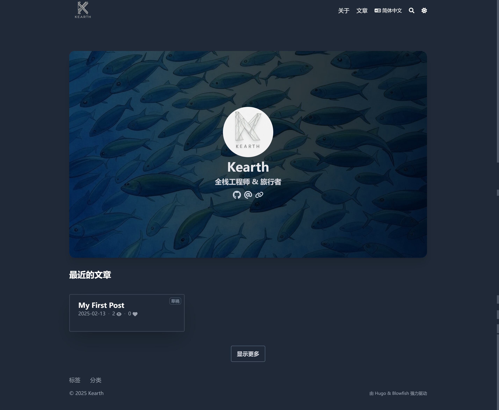

# 🚀 Kearth's Blog

基于 [Hugo](https://gohugo.io/) 和 [Blowfish](https://github.com/nunocoracao/blowfish) 主题搭建的个人博客网站。记录我的技术分享、旅行日志和生活随笔。

---

## 1️⃣ 演示地址

🔗 [https://kearth.github.io/](https://kearth.github.io/)  



---

## 2️⃣ 功能特性
✅ 文章分类、标签  
✅ 响应式设计，移动端友好  
✅ 支持代码高亮和语法块  
✅ 内置 SEO 优化  
✅ 支持 Markdown 写作  
✅ 极简风格主题  

---

## 3️⃣ 技术栈
- ⚙️ 博客框架：Hugo  
- 🎨 主题：Blowfish  
- 📦 部署方式：GitHub Pages
- 🌐 样式：Tailwind CSS  

---

## 4️⃣ 常用命令

```bash
# 本地开发启动（预览草稿）
npm run dev

# 清理构建缓存
npm run clean

# 构建并自动推送到远程仓库
npm run build

# 手动执行 Git 提交和推送
npm run git-push
